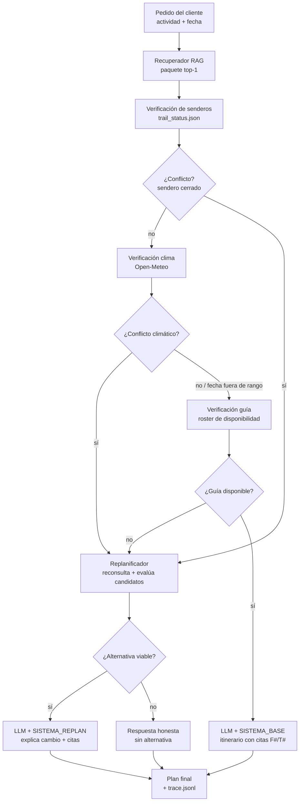

# EP1 — Agente Replanificador de Itinerarios de Ecoturismo

**ISY0101 · Ingeniería de Soluciones con IA · Evaluación Parcial 1 (30%)**

Agente LLM + RAG que genera itinerarios de ecoturismo personalizados (sur de
Chile) y los **replanifica automáticamente** cuando el clima, el estado de los
senderos o la disponibilidad de guías invalidan el plan, entregando el
itinerario final con la fuente que respalda cada decisión. Si ninguna
alternativa es viable, responde de forma honesta sin forzar un paquete.

> **Estado:** Fases 0–6 completas. Suite de tests 16/16, evals 12/12 casos
> (100%, meta ≥85%). Decisiones técnicas y bitácora en
> [`agents.md`](agents.md).

## Pipeline (loop razonamiento-acción)



Cada paso queda registrado en `logs/trace.jsonl` (JSONL con paso, tipo de
evento y hora UTC): qué recuperó, qué tool llamó, por qué replanificó y qué
fuente respalda cada decisión.

## Datos

| Fuente | Origen | Contenido |
|---|---|---|
| Interna (RAG) | `data/internal/paquetes/` | 9 paquetes PAQ-001..009: región, actividad, dificultad, temporada, guía, itinerario con senderos |
| Interna | `data/internal/guias_roster.json` | 5 guías GUI-001..005 con fechas de disponibilidad (ISO) |
| Externa (tool) | `data/external/trail_status.json` | 14 senderos: abierta / precaución / cerrada (simulada, limitación documentada) |
| Externa (tool) | Open-Meteo | Clima real sin API key; fuera de rango (~16 días) devuelve disponible=False sin inventar |

Umbrales de conflicto climático: lluvia ≥10 mm, viento ≥50 km/h, mínima ≤-2 °C.

## Cómo correr

```bash
uv sync
cp .env.example .env   # pegar GROQ_API_KEY (gratis) de https://console.groq.com

# 1. Ingesta a ChromaDB (24 documentos, verificación semántica incluida)
uv run python -m ingestion.ingest

# 2. CLI con el LLM real (LangChain/ChatGroq por defecto, con tracing LangSmith)
uv run python main.py "kayak suave para principiantes en Chiloe" \
    --fecha 2026-12-08 --pasos
# variante SDK crudo: agregar --groq-directo

# 3. CLI determinista (ClienteFalso, sin API key) para demo/CI
uv run python main.py "trekking exigente en Torres del Paine" \
    --fecha 2026-12-15 --pasos --falso

# 4. Tests y evals
uv run python -m pytest -q
uv run python -m tests.eval_agent
```

Notebook de demostración con 5 casos (sin conflicto, replanificación por
temporada/guía, clima tormenta con replan fallida, fecha sin guías, trace):
`notebooks/demo.ipynb`.

Interfaz web básica (Streamlit, solo para demo/presentación):

```bash
uv run streamlit run app.py
# Marca "Modo demo determinista" para no usar API key; incluye los 2 casos
# del guion (PAQ-001 sin conflicto y PAQ-002 → PAQ-009) como botones.
```

## Observabilidad (LangChain / LangSmith, activo)

- `agent/llm_client.py` incluye `ClienteLangChain` (ChatGroq vía
  `langchain-groq`) con el mismo contrato `completar()`; el CLI y la UI
  lo usan por defecto (`--falso` = ClienteFalso, `--groq-directo` = SDK crudo).
- `agent/observabilidad.py` activa LangSmith si `.env` tiene
  `LANGSMITH_API_KEY` (proyecto `ep1-ecoturismo`, ver en
  https://smith.langchain.com/); sin key es no-op. Tests/evals llevan
  tracing apagado (conftest + scripts) para no contaminar el proyecto.

## Replanificación (Fase 4)

Ante un conflicto (sendero cerrado, clima adverso, guía sin agenda, fuera de
temporada) el `Replanificador` (`tools/replanner.py`):

1. Reconsulta el RAG con k=8 y excluye el paquete conflictado.
2. Evalúa cada candidato: temporada vigente, senderos abiertos, clima
   aceptable y guía disponible — cada verificación queda en trace.
3. Elige el primer viable y reconstruye el contexto; el LLM responde con
   `SISTEMA_REPLAN` (explica el cambio y cita las fuentes).
4. Si ninguno es viable, entrega una respuesta honesta sin alternativa
   (`replanificacion_fallida` en trace).

## Evals (Fase 5)

`tests/eval_dataset.json` con 12 casos: sin conflicto, replanificación por
sendero cerrado / clima / guía / temporada, casos sin alternativa viable y
verificación de citas. Corre con `ClienteFalso` (reproducible, sin cuota):

```
Evals: 12/12 casos OK (100%) | meta >= 85%
```

## Limitaciones

- Estado de senderos: CONAF no ofrece API pública → `trail_status.json` se
  consulta como fuente externa simulada.
- Open-Meteo no cubre fechas a más de ~16 días: para fechas futuras lejanas el
  clima no se evalúa (no es conflicto) y la decisión queda respaldada por las
  demás fuentes.
- El roster de guías se indexa (`tipo=guia`) para dejar la fuente en Chroma, pero la recuperación del agente siempre filtra `tipo=paquete`: la disponibilidad se consulta como herramienta, no vía RAG.
- Cuota Groq (200k tokens/día): usar `GROQ_MODEL_FAST` (20b) en dev y evals.
